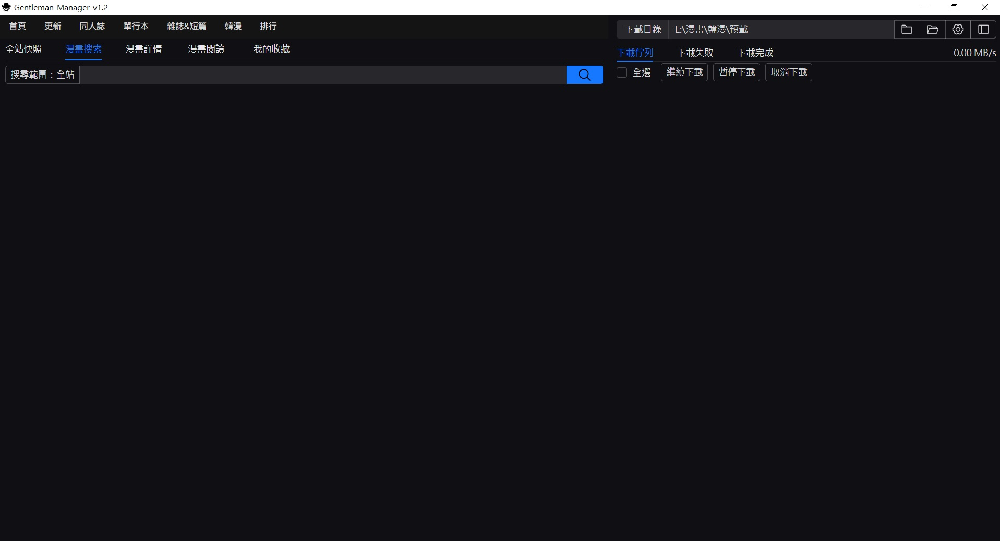

<p align="center">
  
</p>

# Gentleman Manager（紳士管理器）

Gentleman Manager 是一個以 **Tauri 2 + Vue 3 + Rust** 製作的 Windows 桌面管理工具，用於瀏覽、搜尋、下載、整理與本地閱讀 wnacg.com 漫畫內容。

<p align="center">
  
</p>

本倉庫是適合放在 GitHub 上繼續開發的輕量原始碼版本，不包含 `node_modules/`、`dist/`、`src-tauri/target/`、EXE、ZIP 或本機備份檔。clone 後請依照 [DEVELOPMENT.md](./DEVELOPMENT.md) 安裝依賴與建置。

## 目前功能

- 漫畫搜尋：支援關鍵字、漫畫連結、標籤、標籤連結搜尋，搜尋範圍可固定在全站或指定分類。
- 分類瀏覽：支援更新列表、同人誌、單行本、雜誌短篇、韓漫、AI 圖集等分類。
- 排行榜：支援今日、本週、本月、今年，並可依分類篩選。
- 搜尋結果管理：多分頁搜尋、分頁收藏、列表/多欄網格顯示、排序與每頁數量調整。
- 收藏快照：支援全站/分類快照與分頁快照，收藏分頁與快照載入不會覆蓋目前搜尋範圍。
- 快照掃描：支援多分類掃描、分類獨立存檔、保守/激進模式、失敗頁重列隊補掃與詳細進度。
- 接續/更新快照：未完成快照可選頁碼接續或 ID 更新式接續；100% 快照會從首頁掃到重複 ID 門檻後合併新資料。
- 快照輸出：完成後自動排序校準並輸出最終快照到 EXE 同層 `Website Snapshot`，同分類舊檔移至 `Website Snapshot/old`。
- 快照搜尋：分類搜尋可自動使用同分類最新收藏快照進行快速離線搜尋，不影響其他分頁或快照狀態。
- 漫畫詳情：封面、分類、頁數、標籤、簡介、線上閱讀與下載入口。
- 下載佇列：支援未完成、失敗、完成分頁，顯示下載速度，可暫停、繼續、取消與移除紀錄。
- 下載格式：支援官網 Server 2 整包 ZIP，以及逐張 JPEG 下載後打包 ZIP。
- 韓漫批次模式：可依集數/合集分析批次加入下載，並可比對本機 TXT 收藏列表避免重複。
- 本地閱讀：支援開啟 ZIP/CBZ 或資料夾，資料夾模式可列出多章節並切換閱讀。
- 收藏：可收藏漫畫與搜尋分頁，方便後續快速回到常用列表。

## v1.2 階段重點

- `全站快照` 選單保留 `快照掃描` 與 `接續掃描`，快照載入改由收藏快照分頁管理，不再有全域「目前快照」狀態。
- `接續掃描` 依快照完成度分流：未滿 100% 可選頁碼接續或 ID 更新式接續；100% 一律走 ID 更新式掃描。
- ID 更新式掃描從網站第 1 頁開始，一路掃到超過 20 個重複 ID 後停止；若沒有新 ID 只提示已是最新。
- 分類快照完成或更新後會自動排序校準並輸出最終檔；同分類舊檔自動移入 `Website Snapshot/old`，避免覆蓋。
- 分類搜尋方式視窗支援 Enter 送出；若有同分類收藏快照，預設使用最新快照做快速搜尋。

## 技術棧

- 前端：Vue 3、TSX、Pinia、Naive UI、UnoCSS、Vite
- 桌面端：Tauri 2
- 後端：Rust、Tokio、reqwest、zip、image
- 套件管理：pnpm

## 開發環境

請先安裝：

- [Node.js](https://nodejs.org/) LTS
- [pnpm](https://pnpm.io/installation)
- [Rust](https://www.rust-lang.org/tools/install)
- [Tauri 2 prerequisites](https://v2.tauri.app/start/prerequisites/)

首次設定：

```powershell
git clone https://github.com/JACKYLI6207/Gentleman-Manager.git
cd Gentleman-Manager
pnpm install
```

啟動開發環境：

```powershell
pnpm tauri dev
```

Windows 快速建置 EXE：

```powershell
powershell -ExecutionPolicy Bypass -File .\skill\scripts\rebuild-exe.ps1
```

建置完成後，根目錄會產生可直接發佈的 EXE 與 ZIP：

```text
Gentleman-Manager-v1.2.exe
Gentleman-Manager-v1.2.zip
```

Cargo 原始建置產物位於 `src-tauri\target\release-fast\Gentleman-Manager.exe`，腳本會複製到根目錄並壓縮成 ZIP，方便上傳到 GitHub Releases。

## 倉庫內容說明

此倉庫保留開發所需的原始碼、設定、圖示、建置腳本與 lockfile。以下內容刻意不提交：

- `node_modules/`
- `dist/`
- `src-tauri/target/`
- `*.exe`
- `*.zip`
- `skill/backups/`
- `Website Snapshot/`
- `repair/`
- 真實站點快照、下載成品、匯出資料與其他本機產物
- 本機 `.env` 與暫存檔

若要從完整本機工作區同步成 GitHub 用輕量樹，可使用：

```powershell
powershell -ExecutionPolicy Bypass -File .\scripts\sync-to-gentleman-manager.ps1 -Source "C:\path\to\full-workspace"
```

## 注意事項

- 本專案目前主要以 Windows 桌面環境為開發與建置目標。
- 下載目錄預設會使用 EXE 所在資料夾，無法取得時才退回 AppData。
- 個人建置的 EXE 可能被防毒軟體誤判，建議自行從原始碼建置或只信任作者本人發布的 Release。
- 本專案不內建、不代管、不隨 Release 發佈任何第三方內容、漫畫圖片、下載成品或真實站點快照。
- 快照掃描、快照匯入、快照匯出與下載功能僅在使用者本機執行；相關資料來源、保存、分享與使用責任由使用者自行確認。
- 請自行確認使用方式符合所在地法律、目標網站服務條款與第三方權利要求。

## 資料與內容政策

此倉庫只提供工具原始碼、建置設定、圖示與文件。工具可能在使用者本機產生搜尋結果、分類快照、下載紀錄、日誌、ZIP 檔或其他資料，但這些資料不屬於本倉庫內容，也不由本專案代管或背書。

請勿將真實站點快照、含第三方標題/標籤/網址/描述的資料包、下載檔案或其他可能涉及第三方權利與平台規範的內容提交到本倉庫或 Issue。若需要示範資料格式，應使用虛構、脫敏或最小化的 sample data。

## 授權與免責

授權條款見 [LICENSE](./LICENSE)。

本專案基於 MIT 授權之原始專案修改與延伸，保留原作者 [lanyeeee](https://github.com/lanyeeee) 之著作權聲明。

本工具僅供學習、研究與個人管理用途。專案作者不鼓勵、不協助、不代管任何未經授權的內容取得、散布、再上傳或商業使用。

本專案與 wnacg.com 或任何第三方內容平台、作者、出版方、權利人均無從屬、合作、授權或背書關係。所有第三方名稱、網址、標題、標籤與內容權利均歸其各自權利人所有。

使用者需自行承擔使用本工具、匯入外部快照、掃描網站、下載資料、保存資料、分享資料或發布衍生檔案所造成的所有風險與責任。作者不對任何資料遺失、帳號限制、網站封鎖、法律爭議、著作權爭議、平台規範違反、第三方權益問題或其他直接/間接損失負責。
